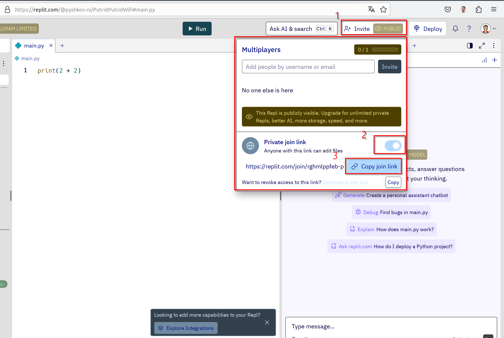

# Кейс 1. Стресс-Python
2 пары
<!-- [Презентация кейса]() -->

## Вводная информация

* Программирование решает разные задачи: от автоматизации процессов до изменения структуры стоимости продукта.
* Программирование является [хард-скиллом](https://spectrumdata.ru/blog/proverka-soiskatelya/soft-skills-i-hard-skills-chto-eto-takoe-i-kak-ikh-otsenit/) — техническим навыком, требующим специальных знаний и опыта в области прикладных наук.

**Что нужно для программирования?**

1. Навык
2. Знания
3. Инструменты

**Подробнее об инструментах**

Инструменты можно разделить на следующие категории:

* `Программное обеспечение`: компиляторы, отладчики, движки и др.;
* `Редакторы`: редакторы текста или кода;
* `Инструменты поддержки цикла разработки`: системы контроля версий, контейнеризация, среды тестирования и др.;
* `Среды разработки`: совокупный программный продукт, включающий вышеперечисленное программное обеспечение для разработки.

Задача инструментов: помочь программисту эффективно писать код.

## Начало работы с Replit

`Replit` — это интегрированная онлайн-среда разработки (IDE), которая позволяет создавать онлайн-проекты и писать код на разных языках программирования.

**Почему Replit?**

* Работать можно (и даже нужно) в удобной для вас среде разработки или редакторе кода.
* Тем не менее, на начальном этапе replit позволяет упростить работу с языком Python.
* Для работы понадобится регистрация на портале и браузер (например, Chrome, Safari или Mozila).
* Установка дополнительных программ на компьютер, кроме браузера, не требуется.

**Задание: начало работы с replit**

<iframe width="560" height="315" src="https://www.youtube.com/embed/tHOyDVBxBvU?si=Z7BiY2hGEDna2RiM" title="YouTube video player" frameborder="0" allow="accelerometer; autoplay; clipboard-write; encrypted-media; gyroscope; picture-in-picture; web-share" referrerpolicy="strict-origin-when-cross-origin" allowfullscreen></iframe>

1. Зарегистрируйтесь в replit.com. Для регистрации перейдите по [ссылке](https://replit.com/).
2. Создайте новый проект с кодом Python.
3. Запустите первый [скрипт](https://blog.skillfactory.ru/glossary/skript/) в файле main.py

Скрипт для вставки
```Python
print(2 + 2)
```

## Условия кейса

**Как студенты готовятся к экзамену?**

На подготовку к экзамену, как правило, дается минимум 3 дня и некоторые студенты приступают к подготовке заранее. Однако большинство студентов предпочитает готовиться вечером перед экзаменом, даже если экзамен включает выполнение большого проектного задания.

В рамках кейса представим, что сегодня именно тот самый день, когда вам необходимо сдать экзамен по дисциплине "Программирование".Преподаватель является вашим экзаменатором и ждет от студентов выполненный проект на языке программирования Python.

## Задание

1. Объединится в группы по 2-3 человека
2. Определите вариант проекта для группы
   [варианты проектов по ссылке](https://docs.google.com/spreadsheets/d/1NA14YElz6Jfmcqx8Wv3Jef1nThxuUeKgljbuVWBeqfk/edit?usp=sharing)
3. Создайте новый проект в replit
4. Выберите файл согласно вашему варианту и скопируйте условие задачи в проект replit.
   * [project_1.py](project_1.py)
   * [project_2.py](project_2.py)
   * [project_3.py](project_3.py)
   * [project_4.py](project_4.py)
   * [project_5.py](project_5.py)
   * [project_6.py](project_6.py)
   * [project_7.py](project_7.py)
   * [project_8.py](project_8.py)
5. Выполните проект ЛЮБЫМ СПОСОБОМ, чтобы не остаться с долгом по дисциплине.
6. Подготовьтесь к защите проекта

_Примечание!_

В проект replit можно приглашать участников и работать совместно через кнопку `Invite`.



## Сдача результатов

Требования к сдаче проекту:

* Проект должен быть выполнен на языке Python;
* Проект может содержать несколько файлов;
* Проект должен использовать данные, который предоставил преподаватель;
* Проект должен работать и выполнять поставленную задачу.

[Ссылку на готовый проект необходимо прислать в форму](https://forms.yandex.ru/cloud/66d7d7d83e9d0827749b5db0/)

Желаю удачи 🍀
За помощью обращайтесь к преподавателю!
